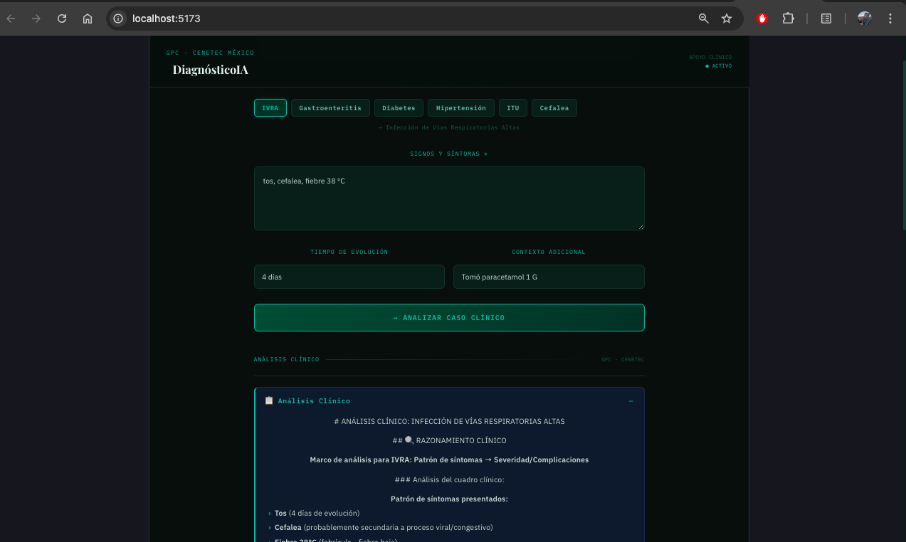
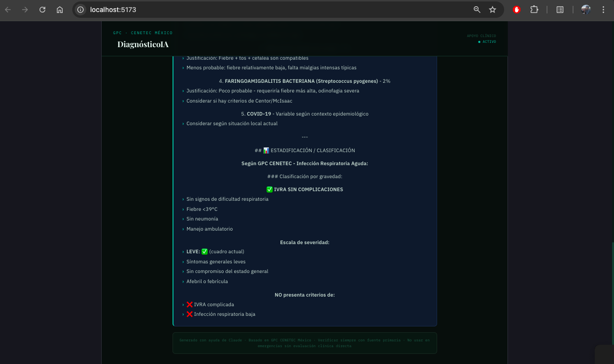

# DiagnósticoIA

**Clinical reasoning support tool** for physicians and medical students, grounded in Mexico's CENETEC Clinical Practice Guidelines (GPC), built with React and the Claude API (Anthropic).

> ⚕️ This tool is intended exclusively for use by healthcare professionals. It does not replace clinical judgment or in-person evaluation.

🇪🇸 [Versión en español disponible](./README.md)

---

## What it does

DiagnósticoIA takes patient signs and symptoms and generates a structured clinical analysis including:

1. **Explicit clinical reasoning** — step-by-step diagnostic process using the condition-specific reasoning framework
2. **Ranked differential diagnoses** with brief clinical justification
3. **Staging and classification** per applicable CENETEC GPC
4. **Recommended management** with first-line pharmacotherapy, doses, referral criteria, and red flag signs
5. **Specific GPC references** used in the analysis

---

## Preview





---

## Conditions covered

| Condition | Reasoning framework | CENETEC GPC |
|---|---|---|
| Upper Respiratory Tract Infection (URTI) | Symptom pattern → severity/complications | GPC IVRAS adult |
| Acute Gastroenteritis | Dehydration severity (WHO scale) → etiology | GPC Acute diarrheal disease |
| Diabetes Mellitus | Acute vs chronic management → complication staging | GPC DM type 2 |
| Arterial Hypertension | Crisis vs non-crisis → cardiovascular risk stratification | GPC HAS |
| Urinary Tract Infection (UTI) | Complicated vs uncomplicated → pathogen probability | GPC UTI adult |
| Headache | ALICIA framework → etiology | GPC Tension headache and migraine |

---

## Architecture

```
User
  │
  ├─ Selects primary condition
  ├─ Enters signs and symptoms, time course, additional context
  │
  ▼
React Frontend (single-page, no backend)
  │
  ├─ Builds structured clinical prompt
  │    └─ System prompt: per-condition clinical framework + CENETEC GPC instruction
  │    └─ User prompt: condition + symptoms + patient context
  │
  ▼
Anthropic Claude API (claude-sonnet-4-20250514)
  │
  ▼
Structured response in 5 sections
  │
  ▼
Parser → collapsible section rendering
```

### Design decisions

- **No backend:** API calls are made directly from the client. Appropriate for a demo/portfolio tool; a production version would require a backend to protect the API key.
- **System prompt as clinical knowledge:** the reasoning framework for each condition is encoded in the system prompt, not in the UI. This separates clinical logic from presentation and allows guideline updates without touching the frontend.
- **Section parsing:** Claude's response is parsed by emoji-marked headers, enabling collapsible section rendering without complex post-processing.
- **Spanish as the sole language:** deliberate design choice to maximize utility in the LatAm clinical context and to demonstrate Spanish-language medical AI capability.

---

## LLM Evaluation criteria

This project was built with explicit attention to the criteria used when evaluating medical language models:

| Criterion | Implementation |
|---|---|
| **Clinical accuracy** | Responses anchored in CENETEC GPC with explicit references |
| **Transparent reasoning** | Model shows its step-by-step process before conclusions |
| **Cultural/linguistic appropriateness** | Mexican Spanish, NOM nomenclature, LatAm clinical context |
| **Red flag detection** | System prompt explicitly instructs identification of alarm signs |
| **Uncertainty calibration** | Model uses probabilistic language ("probable", "rule out") rather than certainties |

---

## Tech stack

- **React 18** — functional components, hooks (useState, useRef, useEffect)
- **Anthropic Claude API** — model claude-sonnet-4-5
- **CSS-in-JS** — inline styles + minimal global classes, no external UI dependencies
- **IBM Plex Sans / IBM Plex Mono / Playfair Display** — typography via Google Fonts

---

## Local setup

```bash
git clone https://github.com/your-username/diagnostico-ia
cd diagnostico-ia
npm install
cp .env.example .env
# Add to .env: VITE_ANTHROPIC_API_KEY=your_api_key
npm run dev
```

> **Security note:** This demo makes direct API calls from the client, which exposes the API key in the browser. Use only with a development key with a low spending limit. For production, implement a backend proxy.

---

## Limitations

See [LIMITATIONS.en.md](./LIMITATIONS.en.md) for full description.

---

## Clinical context

Built by a physician completing mandatory social service (pasantía) as one of two doctors at a silver mining operation clinic in Zimapán, Hidalgo, Mexico. The resource-constrained, high-autonomy clinical environment directly informed the reasoning frameworks implemented — particularly for occupational exposures, independent decision-making, and Spanish-language clinical communication.

---

## License

MIT — free to use with attribution. See [LICENSE](./LICENSE).
